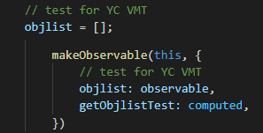

<html>
  <title>React</title>
  <body>

    현재 특이 사항
 
 

  Mobx의 Commponent 관리가 잘되는 것 같다. ( observerble, computed, action ) 
    observable : State의 상태를 감시한다.  
    computed : State의 정보가 변경되면 그 값을 저장하고 다른 정보로 변경될때까지 그 값을 갖고있는다.  
    action : State는 action에서만 변경하여야 위 두가지를 사용하여 효과적으로 State를 관리 할 수 있다.  

 
 
 
 
1.    10 ~ 11 
  Mobx6 로 변경 되면서 decorators가 빠진걸 뒤늦게 알게 되었다..  
    ( 공식 문서에는 자바스크립트의 정식 기능이 아니라서 정식 기능이 될때까지 지양한다고 한다.. )  
  억지로 데코레이터를 사용하게 만들었지만, 정석대로 사용하는게 맞는거 같아서 전부 변경.. 
   
   
2.    12 ~ 현재
  Java Spring MVC 패턴 처럼 구현 해보려 노력 중 
  Model - getter, setter 구현 ( 변수에는 observable, getter에는 computed를 설정 ) 
  Repository - Like DAO 
  Store - Control and Service 
   
  Store에선 Data converting 을 하려했으나..  
  observable로 관리하기 위해서는 Store에서 관리하는게 편하다고 판단, 
  변수를 설정하고 해당 변수를 observable로 설정 
  
  의문..  
  서버에서 받은 데이터들 ( Model list )을 List화 하여 observable, computed로 설정, 데이터를 관리하는데 
  이게 맞는건지... ( State가 변경될때마다 화면에 정상적으로 비동기 변경되긴 함.. ) 

   
  Model 영역  
  
   
   
  Store 영역  
  
   
   
  Store 영역의 Repository를 연결하는 Function 
  

  </body>
</html>
